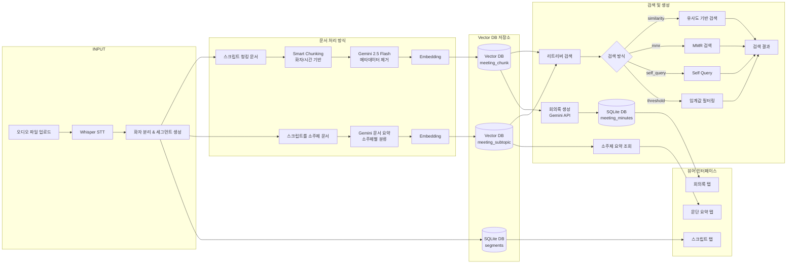

# Minute AI - System Architecture Flowchart

## 📊 Overall System Architecture



## 🎯 Processing Architecture (Based on flowchart.png)

<table>
<tr>
<td width="30%" valign="top">

### 📥 문서 처리 방식
**Document Processing**

#### 1️⃣ 스크립트 청킹 문서
- **입력**: 개별 세그먼트
- **처리**: Smart Chunking
- **정제**: Gemini 2.5 Flash
- **Embedding**: ✅
- **저장**: Vector DB

#### 2️⃣ 스크립트를 소주제 문서
- **입력**: 전체 스크립트
- **처리**: Gemini 문서 요약
- **Embedding**: ✅
- **저장**: Vector DB

</td>
<td width="30%" valign="top">

### 💾 Vector DB 저장소
**Storage Layer**

#### Vector DB
📦 **meeting_chunk**
- 청킹된 대화 조각
- chunk_index로 순서 보장
- 회의록 생성용

📦 **meeting_subtopic**
- 소주제별 요약문
- AI 생성 요약
- 요약 조회용

#### SQLite DB
📊 **segments**
- 원본 스크립트
- 타임스탬프 포함

📊 **meeting_minutes**
- 생성된 회의록

</td>
<td width="40%" valign="top">

### 🔍 검색 및 생성
**Retrieval & Generation**

#### 리트리버 검색 방식

🔹 **유사도 기반 검색**
- Cosine similarity
- Top-K 반환

🔹 **MMR 검색**
- 다양성 보장
- 중복 최소화

🔹 **Self Query**
- 자연어 필터링
- 메타데이터 활용

🔹 **임계값 필터링**
- 품질 보장
- Score threshold

#### 회의록 생성 및 QnA
- Vector DB 조회
- Gemini API 생성
- 구조화된 출력

</td>
</tr>
</table>

---

## 📋 Three-Stage Processing Pipeline

### 🔹 Stage 1: 문서 처리 방식 (Document Processing)

#### **스크립트 청킹 문서** (Script Chunking Document)
```
입력: 개별 스크립트 & 메타데이터
처리: Smart Chunking
  ├─ 화자 변경 감지
  ├─ 시간 간격 분석 (60s threshold)
  └─ 크기 기반 분할 (1000자 max)

메타데이터 제거: Gemini 2.5 Flash
  └─ [Speaker X, MM:SS] 형식 제거

Embedding: OpenAI text-embedding-3-small
출력: Vector DB (meeting_chunk)
```

#### **스크립트를 소주제 문서** (Script to Subtopic Document)
```
입력: 전체 스크립트
처리: Gemini 문서 요약
  ├─ 주요 주제 식별
  ├─ 소주제별 분류
  └─ 요약문 생성

Embedding: OpenAI text-embedding-3-small
출력: Vector DB (meeting_subtopic)
```

### 🔹 Stage 2: Vector DB 저장소 (Storage Layer)

#### **Vector DB Collections**

| Collection | 용도 | 저장 내용 | 메타데이터 |
|-----------|------|----------|-----------|
| **meeting_chunk** | RAG 기반 회의록 생성 | 청킹된 대화 조각 | meeting_id, chunk_index, start_time, end_time, speaker_count |
| **meeting_subtopic** | 소주제별 요약 조회 | AI 생성 요약문 | meeting_id, title, meeting_date, audio_file |

#### **SQLite Database**

| Table | 용도 | 저장 내용 |
|-------|------|----------|
| **segments** | 원본 스크립트 저장 | 화자별 발화 내용 (타임스탬프 포함) |
| **meeting_minutes** | 생성된 회의록 저장 | Gemini가 생성한 정식 회의록 |

### 🔹 Stage 3: 지능형 검색 및 회의록 생성 (Retrieval & Generation)

#### **리트리버 검색 옵션**

```python
# 1. 유사도 기반 검색 (Similarity Search)
{
    "retriever_type": "similarity",
    "k": 5  # 상위 5개 결과
}

# 2. MMR 검색 (Maximal Marginal Relevance)
{
    "retriever_type": "mmr",
    "k": 5,
    "mmr_fetch_k": 20,      # 초기 후보 개수
    "mmr_lambda_mult": 0.5  # 다양성 vs 관련성 (0~1)
}

# 3. Self Query (자연어 필터링)
{
    "retriever_type": "self_query",
    "k": 5
}

# 4. 임계값 필터링 (Score Threshold)
{
    "retriever_type": "similarity",
    "score_threshold": 0.75,  # 유사도 0.75 이상만 반환
    "k": 10
}
```

#### **회의록 생성 프로세스**
```
1. Vector DB에서 청킹된 문서 조회
   └─ ORDER BY chunk_index ASC (순서 보장)

2. Gemini API로 회의록 생성
   ├─ Input: 제목, 전체 스크립트, 청크 배열
   ├─ Process: 구조화된 회의록 작성
   └─ Output: Markdown 형식

3. SQLite DB에 저장
   └─ meeting_minutes 테이블

4. 뷰어에서 HTML로 변환하여 표시
```

#### **소주제 요약 조회 프로세스**
```
1. Vector DB (meeting_subtopic)에서 조회
   └─ meeting_id로 필터링

2. 기존 요약이 있으면 즉시 반환
   └─ 없으면 "요약하기" 버튼 표시

3. 요약 생성 시
   ├─ Gemini API로 소주제별 분류
   ├─ Vector DB에 저장
   └─ 뷰어에 표시
```

## 🔄 Detailed Data Flow

### 1️⃣ Upload & STT Processing Flow

```
Audio File Upload
    ↓
📂 Save to /uploads/
    ↓
🎤 Whisper API Transcription
    ↓
👥 Speaker Diarization
    ↓
📝 Segment Generation
    ├─ speaker_label
    ├─ segment (text)
    ├─ start_time
    └─ end_time
```

### 2️⃣ Smart Chunking Process

```python
# Chunking Logic
for segment in segments:
    current_chunk += segment

    # 청크 분리 조건:
    # 1. 청크 크기 > 1000자
    # 2. 시간 간격 > 60초
    # 3. 화자 변경 + 현재 청크 > 500자

    if should_split:
        formatted_chunk = f"[Speaker {speaker}, {time}] {text}"
        ↓
        cleaned_chunk = gemini_2.5_flash.clean(formatted_chunk)
        ↓
        chunks.append(cleaned_chunk)
```

**Metadata per Chunk:**
- `meeting_id`: 회의 고유 ID
- `title`: 회의 제목
- `meeting_date`: 회의 일시
- `audio_file`: 오디오 파일명
- `chunk_index`: 청크 순서
- `start_time`: 청크 시작 시간
- `end_time`: 청크 종료 시간
- `speaker_count`: 청크 내 화자 수

### 3️⃣ Minutes Generation Flow

```
User clicks "회의록 생성"
    ↓
GET /api/generate_minutes/{meeting_id}
    ↓
📚 Retrieve chunks from Vector DB
    ├─ ORDER BY chunk_index ASC
    ├─ Ensures sequential order
    └─ Full meeting context preserved
    ↓
🤖 Gemini API: generate_minutes(title, transcript, chunks)
    ├─ Input: Chunked documents
    ├─ Process: Structured meeting minutes
    └─ Output: Formal markdown format
    ↓
💾 Save to SQLite meeting_minutes table
    ↓
✅ Display on viewer (HTML conversion)
```

**Key Change:**
- ❌ OLD: Minutes generated from subtopic summaries
- ✅ NEW: Minutes generated directly from chunks

### 4️⃣ Summary Generation Flow

```
User clicks "요약하기"
    ↓
POST /api/summarize/{meeting_id}
    ↓
📝 Retrieve full transcript from SQLite
    ↓
🤖 Gemini API: subtopic_generate(title, transcript)
    ├─ Analyzes entire conversation
    ├─ Identifies key topics
    └─ Generates structured summary
    ↓
💾 Save to Vector DB meeting_subtopic
    ↓
✅ Display on viewer (HTML conversion)
```

### 5️⃣ Enhanced Search System

```python
# 4 Retriever Types

1. Similarity Search
   - Basic cosine similarity
   - Returns top-k most similar chunks
   - Fast and reliable

2. MMR (Maximal Marginal Relevance)
   - fetch_k: 20 (initial candidates)
   - lambda_mult: 0.5 (diversity vs relevance)
   - Reduces redundancy

3. Self Query
   - Natural language filtering
   - Auto-extracts metadata filters
   - Smart query parsing

4. Similarity Score Threshold
   - score_threshold: 0.0-1.0
   - Filters by minimum similarity
   - Quality control
```

## 🗄️ Database Schema

### SQLite Database (`minute_ai.db`)

**Table: `meetings`**
```sql
CREATE TABLE meetings (
    id INTEGER PRIMARY KEY AUTOINCREMENT,
    meeting_id TEXT UNIQUE NOT NULL,
    title TEXT NOT NULL,
    meeting_date DATETIME NOT NULL,
    audio_file TEXT NOT NULL,
    created_at DATETIME DEFAULT CURRENT_TIMESTAMP
);
```

**Table: `segments`**
```sql
CREATE TABLE segments (
    id INTEGER PRIMARY KEY AUTOINCREMENT,
    meeting_id TEXT NOT NULL,
    segment TEXT NOT NULL,
    speaker_label TEXT NOT NULL,
    start_time REAL NOT NULL,
    end_time REAL NOT NULL,
    title TEXT,
    meeting_date DATETIME,
    audio_file TEXT,
    FOREIGN KEY (meeting_id) REFERENCES meetings(meeting_id)
);
```

**Table: `meeting_minutes`**
```sql
CREATE TABLE meeting_minutes (
    id INTEGER PRIMARY KEY AUTOINCREMENT,
    meeting_id TEXT UNIQUE NOT NULL,
    title TEXT NOT NULL,
    meeting_date DATETIME NOT NULL,
    minutes_content TEXT NOT NULL,
    created_at DATETIME DEFAULT CURRENT_TIMESTAMP,
    updated_at DATETIME DEFAULT CURRENT_TIMESTAMP,
    FOREIGN KEY (meeting_id) REFERENCES meetings(meeting_id)
);
```

### Vector Database (ChromaDB)

**Collection: `meeting_chunk`**
- **Purpose**: RAG-optimized semantic chunks
- **Embedding**: OpenAI text-embedding-3-small
- **Metadata**:
  - `meeting_id`, `title`, `meeting_date`, `audio_file`
  - `chunk_index`, `start_time`, `end_time`, `speaker_count`

**Collection: `meeting_subtopic`**
- **Purpose**: AI-generated subtopic summaries
- **Embedding**: OpenAI text-embedding-3-small
- **Metadata**:
  - `meeting_id`, `title`, `meeting_date`, `audio_file`

## 🛠️ Tech Stack

| Category | Technology | Purpose |
|----------|-----------|---------|
| **Backend** | Flask | Web framework |
| **Database** | SQLite | Structured data storage |
| **Vector DB** | ChromaDB | Semantic search |
| **Embeddings** | OpenAI text-embedding-3-small | Vector representations |
| **STT** | Whisper API | Speech-to-text |
| **AI Processing** | Gemini 2.5 Flash | Text cleaning, summarization, minutes generation |
| **Chunking** | Custom Smart Chunking | Speaker/time-aware splitting |
| **Frontend** | Vanilla JavaScript | Interactive viewer |
| **Audio Player** | HTML5 Audio API | Synchronized playback |

## 🔍 Search API Usage Examples

### Similarity Search
```python
POST /api/search
{
    "query": "프로젝트 일정에 대한 논의",
    "db_type": "chunk",
    "retriever_type": "similarity",
    "k": 5
}
```

### MMR Search (Diverse Results)
```python
POST /api/search
{
    "query": "예산 관련 이슈",
    "db_type": "chunk",
    "retriever_type": "mmr",
    "k": 5,
    "mmr_fetch_k": 20,
    "mmr_lambda_mult": 0.7
}
```

### Threshold Filtering
```python
POST /api/search
{
    "query": "기술 스택 결정",
    "db_type": "chunk",
    "retriever_type": "similarity",
    "score_threshold": 0.75,
    "k": 10
}
```

## ⏱️ Processing Timeline

```
Audio Upload
    ↓ ~1-5분 (파일 크기에 따라)
STT Processing (Whisper API)
    ↓ ~10-30초
Smart Chunking + Gemini Cleaning
    ↓ ~5-15초
Vector DB Storage
    ↓
[Ready for Search & Minutes Generation]
    ↓
Summary Generation (Optional)
    ↓ ~20-60초 (회의 길이에 따라)
Vector DB Storage (meeting_subtopic)
    ↓
Minutes Generation
    ↓ ~30-90초 (청크 수에 따라)
SQLite Storage (meeting_minutes)
```

## 🎯 Key Features

1. **Dual Storage Strategy**
   - SQLite: Fast retrieval, structured queries
   - Vector DB: Semantic search, RAG optimization

2. **Smart Chunking Algorithm**
   - Speaker change detection
   - Time gap analysis (60s threshold)
   - Size-based splitting (1000 char max)
   - Preserves conversational context

3. **Gemini-Powered Text Cleaning**
   - Removes `[Speaker X, MM:SS]` formatting
   - Preserves semantic meaning
   - Optimized for embedding quality

4. **Flexible Search System**
   - 4 retriever types
   - Configurable parameters
   - Metadata filtering support

5. **Progressive Enhancement**
   - Upload → Immediate viewing
   - Optional summary generation
   - On-demand minutes creation
   - No dependencies between features

## 📁 Project Structure

```
minute_ai/
├── app.py                      # Main Flask application
├── database/
│   └── minute_ai.db           # SQLite database
├── utils/
│   ├── stt.py                 # Whisper STT & Gemini processing
│   ├── db_manager.py          # SQLite operations
│   ├── vector_db_manager.py   # ChromaDB operations
│   └── validation.py          # Input validation
├── templates/
│   ├── index.html             # Upload page
│   ├── viewer.html            # Meeting viewer
│   └── notes.html             # Meeting list
├── static/
│   ├── css/
│   └── js/
│       └── viewer.js          # Viewer interactions
└── uploads/                    # Audio file storage
```

## 🚀 Future Enhancements

- [ ] Real-time transcription
- [ ] Multi-language support
- [ ] Custom chunking strategies
- [ ] Advanced RAG techniques (HyDE, CRAG)
- [ ] Export to PDF/DOCX
- [ ] Collaborative editing
- [ ] Meeting analytics dashboard

---

## 📝 Document Notes

**Architecture Design**: Based on flowchart.png visual specification
**Last Updated**: 2025-11-03
**Version**: 2.0 (Chunk-based architecture)
**Key Changes from v1.0**:
- ✅ Smart chunking algorithm (speaker/time-aware)
- ✅ Gemini 2.5 Flash for metadata cleaning
- ✅ Chunk-based minutes generation (not summary-dependent)
- ✅ Enhanced search with 4 retriever types
- ✅ Dual storage strategy (SQLite + Vector DB)

**Document Structure**:
- Left → Middle → Right flow
- Document Processing → Storage → Retrieval & Generation
- Matches the three-column layout from flowchart.png
