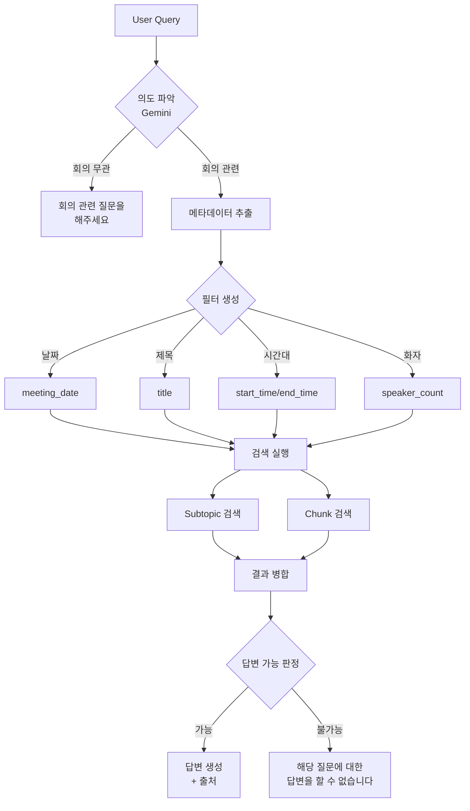

# Minute AI - 인수인계 문서

## 📅 마지막 업데이트: 2025-11-03

---

## 🎯 프로젝트 개요

**Minute AI**는 회의 음성을 텍스트로 변환하고, AI 기반으로 요약 및 회의록을 자동 생성하는 Flask 웹 애플리케이션입니다.

### 핵심 기능
- 🎤 **STT (Speech-to-Text)**: Whisper API로 음성 인식 및 화자 분리
- 📝 **Smart Chunking**: 화자/시간 기반 의미적 청킹
- 🤖 **AI 요약**: Gemini API로 소주제별 요약 생성
- 📄 **회의록 생성**: RAG 기반 구조화된 회의록 작성
- 🔍 **검색 시스템**: 4가지 retriever 타입 지원
- 🗑️ **노트 삭제**: 모든 관련 데이터 일괄 삭제

---

## 📂 프로젝트 구조

```
minute_ai/
├── app.py                      # Flask 메인 애플리케이션
├── database/
│   └── minute_ai.db           # SQLite 데이터베이스
├── utils/
│   ├── stt.py                 # Whisper STT & Gemini 처리
│   ├── db_manager.py          # SQLite 작업 관리
│   ├── vector_db_manager.py   # ChromaDB 벡터 DB 관리
│   └── validation.py          # 입력 유효성 검사
├── templates/
│   ├── layout.html            # 공통 레이아웃
│   ├── index.html             # 업로드 페이지
│   ├── notes.html             # 모든 노트 목록 (삭제 기능 포함)
│   ├── viewer.html            # 회의록 뷰어
│   └── retriever.html         # 검색 테스트 페이지
├── static/
│   ├── css/
│   │   └── style.css
│   └── js/
│       └── viewer.js          # 뷰어 인터랙션
├── uploads/                    # 업로드된 오디오 파일
├── FLOWCHART.md               # 시스템 아키텍처 문서
└── next.md                    # 이 문서
```

---

## 🗄️ 데이터베이스 구조

### SQLite Database (`minute_ai.db`)

#### 1. `meeting_dialogues` 테이블
```sql
CREATE TABLE meeting_dialogues (
    id INTEGER PRIMARY KEY AUTOINCREMENT,
    meeting_id TEXT NOT NULL,
    meeting_date DATETIME NOT NULL,
    speaker_label TEXT NOT NULL,
    start_time REAL NOT NULL,
    segment TEXT NOT NULL,
    confidence REAL,
    audio_file TEXT NOT NULL,
    title TEXT NOT NULL
);
```

#### 2. `meeting_minutes` 테이블
```sql
CREATE TABLE meeting_minutes (
    meeting_id TEXT PRIMARY KEY,
    title TEXT NOT NULL,
    meeting_date TEXT NOT NULL,
    minutes_content TEXT NOT NULL,
    created_at TEXT NOT NULL,
    updated_at TEXT NOT NULL
);
```

### Vector Database (ChromaDB)

#### Collection: `meeting_chunk`
- **용도**: RAG 기반 회의록 생성 및 검색
- **Embedding**: OpenAI text-embedding-3-small
- **메타데이터**:
  ```python
  {
      "meeting_id": str,
      "title": str,
      "meeting_date": str,
      "audio_file": str,
      "chunk_index": int,
      "start_time": float,
      "end_time": float,
      "speaker_count": int
  }
  ```

#### Collection: `meeting_subtopic`
- **용도**: 소주제별 요약 저장 및 조회
- **Embedding**: OpenAI text-embedding-3-small
- **메타데이터**:
  ```python
  {
      "meeting_id": str,
      "title": str,
      "meeting_date": str,
      "audio_file": str
  }
  ```

---

## 🔄 데이터 처리 파이프라인

### 1️⃣ 업로드 & STT 처리
```
오디오 파일 업로드
    ↓
Whisper API 음성 인식
    ↓
화자 분리 (Diarization)
    ↓
세그먼트 생성
    ├─ speaker_label
    ├─ segment (text)
    ├─ start_time
    └─ end_time
```

### 2️⃣ Smart Chunking 프로세스
```python
# utils/vector_db_manager.py의 _create_smart_chunks()

청크 분리 조건:
1. 청크 크기 > 1000자
2. 시간 간격 > 60초
3. 화자 변경 + 현재 청크 > 500자

처리 순서:
1. 세그먼트를 [Speaker X, MM:SS] 형식으로 포맷팅
2. Gemini 2.5 Flash로 메타데이터 제거 (텍스트만 남김)
3. OpenAI Embedding 생성
4. Vector DB (meeting_chunk)에 저장
```

### 3️⃣ 문단 요약 생성
```
전체 스크립트 조회 (SQLite)
    ↓
Gemini API: subtopic_generate()
    ├─ 주요 주제 식별
    ├─ 소주제별 분류
    └─ 요약문 생성
    ↓
Vector DB (meeting_subtopic)에 저장
```

### 4️⃣ 회의록 생성
```
Vector DB에서 청킹된 문서 조회
    └─ ORDER BY chunk_index ASC
    ↓
Gemini API: generate_minutes()
    ├─ Input: 제목, 전체 스크립트, 청크 배열
    ├─ Process: 구조화된 회의록 작성
    └─ Output: Markdown 형식
    ↓
SQLite DB (meeting_minutes)에 저장
    ↓
뷰어에서 HTML로 변환하여 표시
```

---

## 🔍 검색 시스템

### Retriever 타입 (4가지)

#### 1. Similarity Search (유사도 기반)
```python
{
    "retriever_type": "similarity",
    "k": 5
}
```

#### 2. MMR (Maximal Marginal Relevance)
```python
{
    "retriever_type": "mmr",
    "k": 5,
    "mmr_fetch_k": 20,      # 초기 후보 개수
    "mmr_lambda_mult": 0.5  # 다양성 vs 관련성 (0~1)
}
```

#### 3. Self Query
```python
{
    "retriever_type": "self_query",
    "k": 5
}
```

#### 4. Similarity Score Threshold
```python
{
    "retriever_type": "similarity",
    "score_threshold": 0.75,  # 유사도 0.75 이상만
    "k": 10
}
```

### 검색 API 예시
```python
POST /api/search
{
    "query": "프로젝트 일정에 대한 논의",
    "db_type": "chunk",  # 또는 "subtopic"
    "retriever_type": "similarity",
    "k": 5
}
```

---

## 🆕 최근 구현: 노트 삭제 기능 (2025-11-03)

### 구현 위치
- **UI**: `templates/notes.html`
- **Backend**: `app.py` - `/api/delete_meeting/<meeting_id>`
- **DB 로직**: `utils/db_manager.py` - `delete_meeting_by_id()`

### 기능 설명
1. 모든 노트 페이지에서 각 노트 우측에 ✕ 버튼 표시
2. 클릭 시 삭제 확인 모달 표시
3. "예" 클릭 시 다음 데이터 모두 삭제:
   - SQLite DB: `meeting_dialogues`, `meeting_minutes`
   - Vector DB: `meeting_chunk`, `meeting_subtopic`
   - 오디오 파일 (uploads 폴더)

### 코드 위치

**templates/notes.html (lines 16-27, 36-48, 154-221)**
```html
<!-- X 버튼 -->
<button class="delete-note-btn"
        data-meeting-id="{{ meeting.meeting_id }}"
        data-title="{{ meeting.title }}"
        data-audio-file="{{ meeting.audio_file }}"
        onclick="confirmDelete(event, this)">✕</button>

<!-- 삭제 확인 모달 -->
<div id="delete-modal" class="modal">...</div>

<!-- JavaScript 삭제 로직 -->
<script>
async function confirmDelete() {
    const response = await fetch(`/api/delete_meeting/${meetingId}`, {
        method: 'POST',
        body: JSON.stringify({ audio_file: audioFile })
    });
}
</script>
```

**utils/db_manager.py (lines 200-250)**
```python
def delete_meeting_by_id(self, meeting_id):
    """
    meeting_id로 회의와 관련된 모든 데이터 삭제
    - meeting_dialogues에서 세그먼트 삭제
    - meeting_minutes에서 회의록 삭제
    """
    # 1. meeting_dialogues에서 삭제
    cursor.execute("DELETE FROM meeting_dialogues WHERE meeting_id = ?", (meeting_id,))

    # 2. meeting_minutes에서 삭제
    cursor.execute("DELETE FROM meeting_minutes WHERE meeting_id = ?", (meeting_id,))
```

**app.py (lines 335-394)**
```python
@app.route("/api/delete_meeting/<string:meeting_id>", methods=["POST"])
def delete_meeting(meeting_id):
    # 1. SQLite DB에서 삭제
    deleted_sqlite = db.delete_meeting_by_id(meeting_id)

    # 2. Vector DB (meeting_chunk) 삭제
    vdb_manager.delete_from_collection(db_type="chunk", meeting_id=meeting_id)

    # 3. Vector DB (meeting_subtopic) 삭제
    vdb_manager.delete_from_collection(db_type="subtopic", meeting_id=meeting_id)

    # 4. 오디오 파일 삭제
    os.remove(audio_path)
```

---

## 🤖 다음 작업: 챗봇 시스템 구현

### 목표
회의록 AI에 지능형 챗봇을 추가하여 사용자가 자연어로 회의 내용을 질의할 수 있도록 함.

### 핵심 요구사항

#### 1. 의도 파악 (Intent Analysis)
```python
User Query → Gemini 2.5 Flash 분석

출력:
{
    "is_meeting_related": bool,
    "intent_type": "DATE_RANGE|SPECIFIC_MEETING|TOPIC_SEARCH|...",
    "filters": {
        "meeting_date": "YYYY-MM-DD",
        "title_keyword": "키워드"
    },
    "optimized_query": "검색 최적화 쿼리",
    "confidence": 0.0-1.0
}

처리:
- 회의 무관 질문 → "회의에 관련된 질문을 해주세요." 출력 후 종료
- 날짜 질의 → metadata의 meeting_date로 범위 축소
- 기타 → 사용 가능한 모든 metadata 활용하여 검색 정밀화
```

#### 2. 데이터 소스
- **청킹 데이터** (meeting_chunk collection)
- **문단 요약 데이터** (meeting_subtopic collection)
- **두 소스 병합 및 Rerank 수행**

#### 3. 답변 판정
```python
검색 결과 + 질문 비교 → Gemini 판정

if 답변 가능:
    답변 생성 + 출처 표시
else:
    "해당 질문에 대한 답변을 할 수 없습니다." 출력
```

#### 4. 제약사항
- ❌ 새로운 metadata 필드 생성 금지
- ❌ 새로운 DB 구조 생성 금지
- ✅ 기존 코드베이스의 것만 사용

### 구현 계획

#### 파일 구조
```
utils/
├── chat_manager.py          # 🆕 생성 필요
│   ├─ IntentAnalyzer       # 의도 파악
│   ├─ MetadataExtractor    # 메타데이터 필터 추출
│   ├─ ChatRetriever        # 검색 로직 (Subtopic + Chunk)
│   ├─ AnswerGenerator      # 답변 생성/판정
│   └─ ChatBot              # 메인 클래스
│
app.py
├─ /api/chat [POST]         # 🆕 엔드포인트 추가
│
templates/
├── chatbot.html            # 🆕 독립 챗봇 페이지
└── viewer.html             # 🔧 챗봇 탭 추가 (선택)
```

#### 처리 흐름


#### 핵심 클래스 설계

**1. IntentAnalyzer**
```python
class IntentAnalyzer:
    def analyze(self, query: str) -> dict:
        """
        Gemini 2.5 Flash로 질문 의도 분석

        Returns:
        {
            "is_meeting_related": bool,
            "intent_type": str,
            "filters": dict,
            "optimized_query": str,
            "confidence": float
        }
        """
```

**2. MetadataExtractor**
```python
class MetadataExtractor:
    def extract_filters(self, analysis: dict, available_meetings: list) -> dict:
        """
        현재 DB의 메타데이터로 ChromaDB where 필터 생성

        사용 가능한 metadata:
        - meeting_id
        - title
        - meeting_date
        - audio_file
        - chunk_index (chunk만)
        - start_time (chunk만)
        - end_time (chunk만)
        - speaker_count (chunk만)
        """
```

**3. ChatRetriever**
```python
class ChatRetriever:
    def retrieve(self, query: str, filters: dict, k: int = 5) -> list:
        """
        Two-stage retrieval:
        1. Subtopic에서 개요 검색
        2. Chunk에서 상세 검색
        3. 결과 병합 및 rerank
        """
```

**4. AnswerGenerator**
```python
class AnswerGenerator:
    def judge_and_generate(self, query: str, retrieved_docs: list) -> dict:
        """
        Gemini로 답변 가능 여부 판정 및 생성

        Returns:
        {
            "can_answer": bool,
            "confidence": float,
            "answer": str,
            "sources": list
        }
        """
```

**5. ChatBot (메인 클래스)**
```python
class ChatBot:
    def process_query(self, query: str, meeting_id: str = None) -> dict:
        """
        전체 파이프라인 실행

        1. 의도 파악
        2. 필터 생성
        3. 검색
        4. 답변 생성
        """
```

#### API 엔드포인트

**POST /api/chat**
```python
Request:
{
    "query": "프로젝트 일정은 언제로 결정됐어?",
    "meeting_id": "abc-123" (선택, 특정 회의 질의)
}

Response (성공):
{
    "success": true,
    "answer": "프로젝트 일정은 2025년 3월 15일로 결정되었습니다.",
    "confidence": 0.92,
    "sources": [
        {
            "meeting_id": "abc-123",
            "title": "프로젝트 킥오프 회의",
            "chunk_index": 5,
            "timestamp": 120
        }
    ]
}

Response (실패 - 회의 무관):
{
    "success": false,
    "message": "회의에 관련된 질문을 해주세요."
}

Response (실패 - 답변 불가):
{
    "success": false,
    "message": "해당 질문에 대한 답변을 할 수 없습니다."
}
```

### UI 옵션

#### Option 1: 독립 챗봇 페이지
- 경로: `/chatbot`
- 전체 회의 대상 검색
- 회의 선택 드롭다운

#### Option 2: Viewer에 챗봇 탭 추가
- 현재 보고 있는 회의에 대해서만 질문
- 탭: 스크립트 | 문단 요약 | 회의록 | 챗봇

#### 추천: Option 2 + Option 1 병행
- Viewer: 특정 회의 QnA
- 독립 페이지: 전체 회의 통합 검색

### 추가 기능 제안

#### 1. 출처 링크
```python
# 답변에 타임스탬프 링크 포함
sources = [
    {
        "title": "프로젝트 킥오프 회의",
        "timestamp": 120,
        "link": "/view/{meeting_id}?t=120"  # 해당 시점으로 점프
    }
]
```

#### 2. 추천 질문
```python
# 회의 내용 기반 자동 생성
suggested_questions = [
    "이 회의의 주요 결정사항은?",
    "다음 액션 아이템은?",
    "참석자는 누구였어?"
]
```

#### 3. 대화 히스토리 (선택)
```python
# 세션 기반 맥락 유지
chat_history = [
    {"role": "user", "content": "예산은 얼마야?"},
    {"role": "assistant", "content": "500만원입니다."},
    {"role": "user", "content": "그건 언제 결정됐어?"}  # 맥락 활용
]
```

### 구현 우선순위

| 우선순위 | 작업 항목 | 예상 시간 | 파일 |
|---------|----------|----------|------|
| **P0** | IntentAnalyzer 구현 | 2시간 | utils/chat_manager.py |
| **P0** | MetadataExtractor 구현 | 1시간 | utils/chat_manager.py |
| **P0** | ChatRetriever 구현 | 2시간 | utils/chat_manager.py |
| **P0** | AnswerGenerator 구현 | 2시간 | utils/chat_manager.py |
| **P0** | ChatBot 메인 클래스 | 1시간 | utils/chat_manager.py |
| **P0** | /api/chat 엔드포인트 | 1시간 | app.py |
| **P1** | Viewer에 챗봇 탭 추가 | 2시간 | templates/viewer.html, static/js/viewer.js |
| **P1** | 독립 챗봇 페이지 | 2시간 | templates/chatbot.html |
| **P2** | 출처 링크 기능 | 1시간 | utils/chat_manager.py |
| **P2** | 추천 질문 생성 | 2시간 | utils/chat_manager.py |
| **P3** | 대화 히스토리 | 3시간 | utils/chat_manager.py, app.py |

---

## 🛠️ 기술 스택

| Category | Technology | Version |
|----------|-----------|---------|
| **Backend** | Flask | Latest |
| **Database** | SQLite | 3.x |
| **Vector DB** | ChromaDB | Latest |
| **Embeddings** | OpenAI text-embedding-3-small | - |
| **STT** | Whisper API | - |
| **LLM** | Gemini 2.5 Flash | Latest |
| **Frontend** | Vanilla JavaScript | ES6+ |
| **Audio** | HTML5 Audio API | - |

---

## 🔑 환경 변수 (.env)

```bash
# OpenAI API (Embedding & Whisper)
OPENAI_API_KEY=sk-...

# Google Gemini API (Text Processing)
GOOGLE_API_KEY=...
```

---

## 📝 주요 API 엔드포인트

### 업로드 & 처리
- `POST /upload` - 오디오 파일 업로드 및 STT 처리

### 뷰어
- `GET /view/<meeting_id>` - 회의록 뷰어 페이지
- `GET /api/meeting/<meeting_id>` - 회의 데이터 조회

### 요약 & 회의록
- `POST /api/summarize/<meeting_id>` - 문단 요약 생성
- `GET /api/check_summary/<meeting_id>` - 요약 존재 여부 확인
- `POST /api/generate_minutes/<meeting_id>` - 회의록 생성
- `GET /api/get_minutes/<meeting_id>` - 회의록 조회

### 검색
- `POST /api/search` - Vector DB 검색

### 삭제 (2025-11-03 추가)
- `POST /api/delete_meeting/<meeting_id>` - 회의 데이터 전체 삭제

### 기타
- `GET /notes` - 모든 노트 목록
- `GET /retriever` - 검색 테스트 페이지

---

## 🐛 알려진 이슈 및 제약사항

### 1. ChromaDB 메타데이터 필터링 제한
- 부분 문자열 매칭 불가 (정확한 일치만 가능)
- 범위 필터 제한적 (`$gte`, `$lte` 등 일부만 지원)
- **해결 방법**: 검색 후 Python에서 후처리 필터링

### 2. Gemini API Rate Limit
- 분당 요청 수 제한 있음
- **해결 방법**: 에러 핸들링 및 재시도 로직 필요

### 3. 대용량 오디오 파일 처리
- Whisper API 타임아웃 가능성
- **해결 방법**: 청크 단위 분할 처리 고려

---

## 🚀 실행 방법

### 1. 환경 설정
```bash
# 가상환경 생성
python -m venv venv

# 가상환경 활성화
source venv/bin/activate  # Linux/Mac
venv\Scripts\activate     # Windows

# 의존성 설치
pip install -r requirements.txt
```

### 2. 환경 변수 설정
```bash
# .env 파일 생성
OPENAI_API_KEY=your_openai_key
GOOGLE_API_KEY=your_gemini_key
```

### 3. 서버 실행
```bash
python app.py
# http://localhost:5050 접속
```

---

## 📚 참고 문서

- **FLOWCHART.md**: 시스템 아키텍처 상세 문서
- **utils/vector_db_manager.py**:
  - `_create_smart_chunks()`: Smart chunking 알고리즘 (lines 174-252)
  - `_clean_text_with_gemini()`: Gemini 텍스트 정제 (lines 79-125)
  - `search()`: 검색 함수 (lines 312-407)
- **utils/db_manager.py**:
  - `delete_meeting_by_id()`: 회의 삭제 (lines 200-230)
- **app.py**:
  - `/api/delete_meeting`: 삭제 API (lines 335-394)

---

## 💡 다음 세션 작업 시작 가이드

### 챗봇 구현을 시작하려면:

1. **utils/chat_manager.py 생성**
   ```bash
   touch utils/chat_manager.py
   ```

2. **IntentAnalyzer 클래스부터 구현**
   - Gemini 2.5 Flash로 질문 분석
   - JSON 구조화된 출력

3. **테스트 쿼리 준비**
   ```python
   test_queries = [
       "프로젝트 일정은 언제야?",           # DATE_RANGE
       "어제 회의 내용 요약해줘",           # DATE_RANGE
       "오늘 날씨 어때?",                  # NOT_MEETING_RELATED
       "킥오프 회의에서 누가 발표했어?",   # SPECIFIC_MEETING
   ]
   ```

4. **점진적 구현 순서**
   - IntentAnalyzer → MetadataExtractor → ChatRetriever → AnswerGenerator → ChatBot 통합

### 질문이 필요한 사항:
- [ ] UI 위치: Viewer 탭 vs 독립 페이지 vs 둘 다?
- [ ] 검색 범위: 특정 회의만 vs 전체 회의?
- [ ] 대화 히스토리: 필요 여부?
- [ ] 출처 링크: 타임스탬프 점프 기능 필요 여부?

---

## 📞 문의 및 이슈

- 구현 중 막히는 부분이 있으면 FLOWCHART.md와 이 문서를 참조
- 기존 코드 패턴을 최대한 유지하며 확장

---

**작성자**: Claude Code
**마지막 업데이트**: 2025-11-03
**다음 작업**: 챗봇 시스템 구현 (utils/chat_manager.py)
